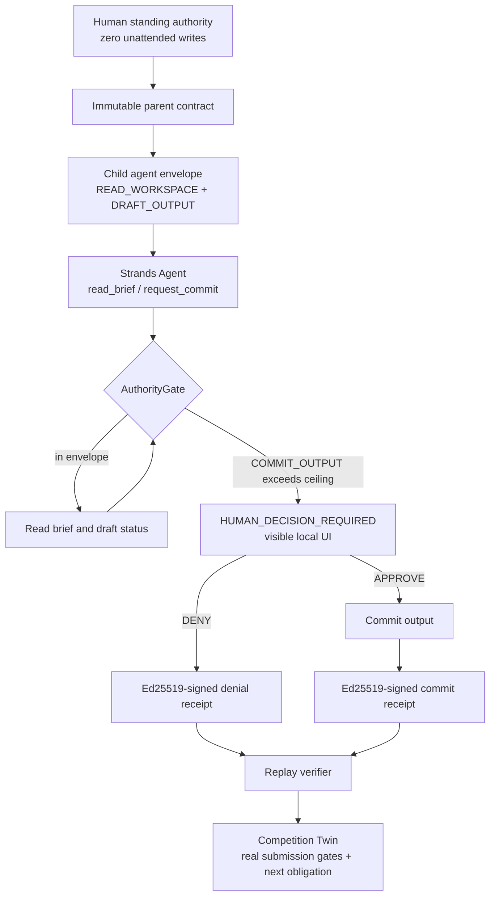

# Stop-and-Ask Agent Architecture

The contract and gate are deterministic code. The model can propose a tool call,
but it cannot enlarge the child envelope or commit beyond its write ceiling.

`requirements.lock` records the full observed dependency set for the local
demonstration. A live Bedrock provider run remains an external credential gate.

The Competition Twin is a read-only view over the same execution/submission
evidence. It does not authorize or perform an effect: it identifies the next
required effect and whether that boundary requires a human.
